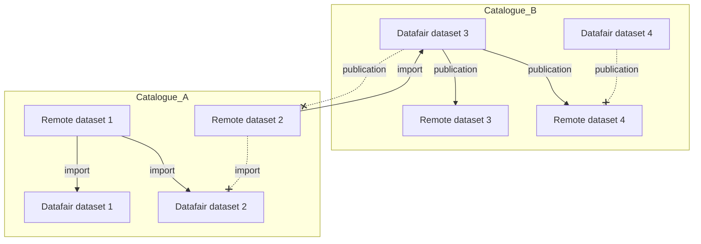

# Contribution guidelines

## Prerequisites

- A Javascript/Typescript IDE with [Vue.js](https://vuejs.org/) and [ESLint](https://marketplace.visualstudio.com/items?itemName=dbaeumer.vscode-eslint) support.
- A recent [Docker](https://docs.docker.com/engine/install/) installation.
- [Node.js v24+](https://nodejs.org/)

## Install dependencies

1. Install npm dependencies for all workspaces :

```sh
npm i
```

2. Build / Update the types based on schemas :

```sh
npm run build-types
```

## Start the development environment

```sh
npm run dev-zellij
```

*Note : This command will start a Zellij session with 4 panes, each one running a part of the project. You can also run the environment manually by running the commands below in 4 different terminals.*

<details>
<summary>Services</summary>

- **Dev dependencies** : `npm run dev-deps`
- **Api** : `npm run dev-api`
- **UI** : `npm run dev-ui`
- **Portal** : `npm run dev-portal`

</details>

## Stop the development environment

```sh
npm run stop-dev-deps
```

## Building the Docker images

```sh
docker build --progress=plain --target=main -t data-fair/catalogs:dev .
docker build --progress=plain --target=worker -t data-fair/catalogs/worker:dev .
```

## Running the tests

First, you need to start the development dependancies

```sh
npm run dev-deps
```

Then, you can run the tests.

```sh
npm run test
```

To run a specific test, you can mark it with `it.only` or `describe.only` in the test file, then run the tests with :

```sh
npm run test-only test-it/file-name.ts
```

## Zellij installation

<details>
<summary>Guide</summary>

1) Install Rust's Cargo

```sh
curl https://sh.rustup.rs -sSf | sh
# choose 1 when prompted
```

2) Install Zellij

```sh
cargo install --locked zellij
```

3) Install NVM

```sh
curl -o- https://raw.githubusercontent.com/nvm-sh/nvm/master/install.sh | bash
nvm install
```

*Tips :*

- Use <kbd>Ctrl</kbd> + <kbd>Q</kbd> to quit Zellij.
- Click on a panel, then use <kbd>Ctrl</kbd> + <kbd>C</kbd> then <kbd>Esc</kbd> to stop a terminal and regain access of the panel.

</details>

## Setup the development environment

TODO

## Random information

<details>
<summary>Expand...</summary>

### package.json scripts description

- `"prepare": "husky || true"` : Initializes Husky hooks before the first `npm install`. The `|| true` ensures the command doesn't fail if Husky is not installed or encounters an error.
- `EVENTS_LOG_LEVEL=alert` : Disable the lib express events log in the console, to avoid too much noise.

</details>

## Permissions rules

- Only admin and superadmins can create, read, update and delete pages and portals.

- In the UI, if we have the right to see a catalog, but the active account is not the same as the owner, an alert is shown to the user to inform him to change the active account.
- Plugins are available for all admins users !

### Permissions Matrix to create/edit/delete catalogs

*How to read : A user in (organization/department) (can/cannot) create/edit a catalog in (organization/department) level*

| User Level | Permission | Catalog Level |
|------------|--------------|------------|
| Organization | ✅ Can | Organization |
| Organization | ✅ Can | Department |
| Department | ❌ Cannot | Organization |
| Department | ✅ Can | Department |

### Permissions to import datasets

- For the moment, the owner of the imported dataset must be the same as the owner of the catalog.
- An organization admin can import datasets from any catalog, including those owned by a department.
- A department admin can only import datasets from catalogs owned by the same department.

### Permissions Matrix to publishing datasets

| Dataset Level | Catalog Level | User Level | Permission | Comments |
|------------|------------|--------------|------------|-|
| Organization | Organization | Organization | ✅ Allowed | |
| Organization | Organization | Department | ❌ Forbidden | |
| Organization | Department | Organization | ❌ Forbidden | |
| Organization | Department | Department | ❌ Forbidden | |
| Department | Organization | Organization | ✅ Allowed | |
| Department | Organization | Department | ❓ Ask admin | TODO: For the moment, this is just forbidden |
| Department | Department | Organization | ✅ Allowed | |
| Department | Department | Department | ✅ Allowed | |

## Possible relations between Remote datasets and Datafair datasets


