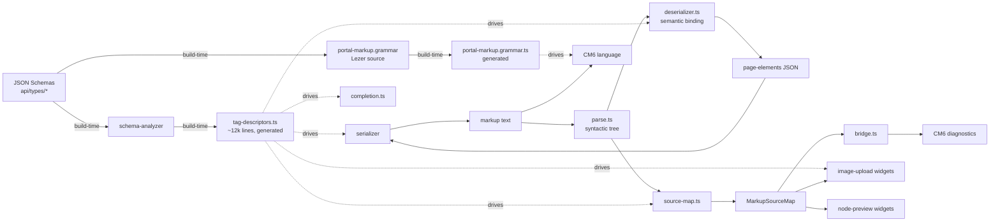

# Portal markup editor

Single-source architecture doc for the markup edition feature: the XML-like
language used to edit portal pages, its CodeMirror 6 integration, and the
Vue-side wiring that surfaces it in `edit-config.vue`. Intended for both
human reviewers and agents working in this repo.

> History: the branch `feat-better-page-edition` shipped this feature. If
> something here contradicts the code, the code wins — update this doc.

---

## 1. Why it exists

The "form" mode for page editing (VJSF-generated forms rendered inside
StatefulLayout) is great for discoverability but painful for power users: a
single page element has up to 50 attributes across nested objects, and a
whole page may contain dozens of elements. The markup mode offers the same
elements as an XML-flavored text language with autocomplete, live
validation, and inline widgets (image upload, node preview).

Key goals driving the design:

- **Identical validation in both modes.** Form and markup share a single
  StatefulLayout instance; ajv errors from that instance are mapped onto
  markup ranges, not re-computed.
- **Schema-driven, zero-duplication.** Every element type is defined once in
  `api/types/*/schema.js`. The tag grammar, attribute list, validation,
  autocomplete catalog, and widget metadata are all derived from the schemas
  at build time.
- **Graceful failure.** The editor stays usable mid-edit: parse errors
  produce diagnostics and preserve a best-effort source map so widgets and
  autocomplete keep working.

---

## 2. High-level pipeline



Runtime cycle inside the editor: markup text → `parse.ts` produces a
`ParsedTag` tree → `source-map.ts` indexes JSON pointers to char ranges →
`deserializer.ts` binds to JSON using `tagDescriptors`. On save, the JSON is
pushed back to the form StatefulLayout; on load, `serializer.ts` produces
canonical markup.

---

## 3. Module layout

```
build/markup/                         # build-time only
  generate-descriptors.ts             # schema → tag-descriptors.ts
  generate-grammar.ts                 # Lezer .grammar → .grammar.ts
  schema-analyzer.ts                  # schema walker (titles, attrs, slots)

shared/markup/
  tag-descriptors.ts                  # GENERATED, 12k lines
  types.ts                            # TagDescriptor, ChildrenSlot, ...
  serializer.ts                       # JSON → markup text
  parse.ts                            # syntactic parser → ParsedTag tree
  source-map.ts                       # ParsedTag → MarkupSourceMap
  deserializer.ts                     # public entry: markup → JSON
  walker.ts                           # descriptor-driven JSON traversal
  index.ts                            # barrel for non-CM6 consumers

  codemirror/
    portal-markup.grammar             # Lezer source
    portal-markup.grammar.ts          # GENERATED parser
    portal-markup.grammar.terms.ts    # GENERATED token ids
    language.ts                       # LRLanguage + highlight / indent / fold
    validation.ts                     # linter: parse errors + external diagnostics
    completion.ts                     # tag/attr/value autocomplete source
    bridge.ts                         # StatefulLayout ↔ CM6 adapter (pure)
    image-upload-widgets.ts           # inline upload widget + range logic
    node-preview-widgets.ts           # gutter-toggled block preview widget
    index.ts                          # portalMarkupExtensions bundle

ui/src/
  components/page-edit/
    page-edit-elements-markup.vue     # main editor component
  components/markup-widgets/
    markup-image-widget.vue           # Teleport-mounted upload UI
    markup-preview-widget.vue         # Teleport-mounted preview (error boundary)
  pages/pages/[pageId]/
    edit-config.vue                   # Form ↔ Markup toggle

tests/features/markup/                # unit tests (14 files)
tests/features/ui/markup-edit.e2e.spec.ts   # end-to-end
```

---

## 4. Build-time generation

Two artifacts are generated from the schemas and committed to the repo
(marked `linguist-generated` in `.gitattributes` so GitHub collapses them in
diffs):

**`shared/markup/tag-descriptors.ts`** (~12k lines) — one
`TagDescriptor` per element type, flattening nested object properties into
dotted attribute paths (`background.color`, `thumbnail.image._id`, ...),
extracting enum values and localized titles, and tagging
`image-upload`-slot properties as `ImageUploadGroup`s so the markup widget
can detect them at runtime.

```bash
node --import tsx build/markup/generate-descriptors.ts
```

**`shared/markup/codemirror/portal-markup.grammar.ts`** — Lezer LR
parser produced from `portal-markup.grammar`. Used only for CM6 syntax
highlighting and folding. The semantic parse is separate (see §5) — the
Lezer tree is not yet used to extract elements.

```bash
node --import tsx build/markup/generate-grammar.ts
```

Rule for contributors: **never edit the `.ts` output directly.** Change the
schema or `.grammar` source, regenerate, commit both together.

---

## 5. Core data model

### `TagDescriptor`

Metadata for one element type (`types.ts`):

- `tagName` — the markup tag, e.g. `"dataset-table"`.
- `contentProperty` — JSON property holding inner text (e.g. `text` for
  `<text>`), or `null` when children are structured.
- `childrenSlots: ChildrenSlot[]` — where nested items live. Each slot has:
  - `property` — JSON array property (`children`, `tabs`, `actions`, ...).
  - `virtualTag` — markup wrapper (e.g. `tab` for the `tabs` property), or
    `null` for direct nesting into the tag body.
  - `kind` — `'direct'` (page elements), `'structured'` (objects with a
    `children` sub-array, like tabs/panels), `'link'` (self-closing items).
  - `itemAttributes` — attributes on the virtual wrapper tag, for
    structured/link kinds.
- `attributes: AttributeDescriptor[]` — flattened leaf properties with
  type, enum, default, required, localized titles.
- `imageUploadGroups?` — schema locations marked as `image-upload`, used
  by the inline widget.
- `titles` / `enumTitles` — localized labels for tags and enum values.

Every serializer/deserializer decision reads from this record. The semantic
binding layer never touches raw JSON Schema at runtime.

### `MarkupSourceMap`

Two maps pairing JSON pointers with character ranges (`types.ts`):

- `byPointer` — **tightest** range for a pointer (attribute value between
  the quotes, or content span inside the tag).
- `byElementPointer` — **open-tag** range for each element pointer. Used
  as a fallback when an ajv error's `instancePath` points to the parent
  object (e.g. required-field errors).

Populated opportunistically: entries exist for every fully-parsed
attribute/tag regardless of whether the overall parse succeeded. Any widget
or diagnostic that keys off pointers should resolve through
`bridge.resolveRange`, which walks ancestors on miss.

---

## 6. Parsing pipeline

The deserialization path is split into three files, layered strictly bottom
to top:

### 6.1 `parse.ts` — syntactic

Hand-rolled recursive descent producing a `ParsedTag` tree with
character-offset and line/col tracking. Recovers from malformed input
(missing quotes, unclosed tags, stray text) and pushes errors into a shared
`Parser` error list. Knows nothing about tag descriptors or the target JSON
shape — purely lexical.

Public surface: `makeParser`, `parseRootTags`, `reportError`,
`unescapeContent`. Types: `Parser`, `ParsedTag`, `AttrRange`,
`DeserializeError`.

### 6.2 `source-map.ts` — ranges

Walks the `ParsedTag` tree and populates a `MarkupSourceMap` whose pointer
shape mirrors the JSON produced by the semantic pass — so virtual slot tags
(`<tab>`, `<panel>`, `<action>`) never appear in the pointer path, but
their items contribute array indices under the slot property they belong
to. Keeping this aligned with `deserializer.buildElement` is a live
invariant; any change to one requires the matching change in the other.

### 6.3 `deserializer.ts` — semantic binding

Converts the `ParsedTag` tree into a JSON page-elements array using
`tagDescriptors`: coerces attribute values to their scalar type, unwraps
virtual slot tags into target properties, checks structural validity
(e.g. raw-content tags must not have nested tags). Finally `healUuids`
regenerates uuids for iframe-hosting elements so copy-paste produces
distinct ids.

Public entry: `deserializeElements(src) → { elements, errors, sourceMap }`.
When `errors.length > 0`, `elements` is `null` and callers must leave
underlying data untouched; `sourceMap` is still populated best-effort.

**Why three files, not one.** The original monolithic deserializer mixed
tokenization, tree-building, source-map construction, and descriptor-driven
binding. Splitting makes each concern independently testable and clarifies
the contract between layers — in particular, source-map building does not
require a valid descriptor-level parse, which is what keeps the editor
usable mid-edit.

---

## 7. Serialization

`serializer.ts` is the inverse of the deserialization chain: JSON → markup
text. It drops attributes equal to the schema default (keeps markup
compact), emits virtual slot wrappers, and escapes `&`, `<`, `"`. On save,
the editor re-runs `serializeElements` so markup is normalized (attribute
order, default stripping, indentation) and the text doesn't drift as the
user edits.

Round-trip guarantee: for any JSON that matches the schemas,
`deserialize(serialize(json))` returns an equivalent JSON. Verified by
`tests/features/markup/round-trip.unit.spec.ts` across a fixture suite.

---

## 8. CodeMirror 6 integration

### 8.1 `language.ts`

Wraps the generated Lezer parser with `LRLanguage.define`, attaching
highlight tags, `delimitedIndent` for `<foo>...</foo>` blocks, and
`foldInside` on `Element` nodes. Nothing in this file depends on
tag-descriptors — it's a dumb syntax layer.

### 8.2 `validation.ts`

Two linters running in parallel, both contributing to CM6 diagnostics:

- `deserializerLinter` (300ms debounce) — runs `deserializeElements` and
  anchors each `DeserializeError` at its line/col.
- `externalDiagnosticsLinter` — re-emits whatever was last dispatched via
  the `setMarkupExternalDiagnostics` StateEffect. This is the channel for
  schema errors from StatefulLayout.

Keeping external diagnostics on a dedicated field (not recomputed per
update) lets the Vue layer dispatch them at its own cadence.

### 8.3 `completion.ts`

Lezer-tree-driven autocomplete source with three branches: tag names
(real + virtual, assembled via `collectVirtualTags`), attribute names for
the enclosing tag, and attribute values (enum, boolean). Host-provided
`asyncValueCompletions` augments values with dynamic suggestions (dataset
ids, URLs from the page index).

Locale is captured at mount — `useI18n().locale` is not reactive once CM6
is running, so the editor re-creates its completion source if the user
switches language.

### 8.4 `bridge.ts`

Pure TS helpers that adapt a StatefulLayout error tree into CM6
diagnostics, via the source map. Duck-typed on `{ dataPath, error,
children }` so `@json-layout/core` stays a concern of the UI layer, not of
`shared/markup`. Four entry points:

- `collectErrorsByDataPath` — flatten the tree.
- `toRelativePointer` — strip the `elements`-array prefix from an ajv path.
- `offsetToElementPointer` — find the innermost enclosing element at a
  char offset (used for completion context).
- `resolveRange` — look up tight range, fall back to element range, walk
  ancestors on miss. Handles ajv "required" errors pointing at the parent.

### 8.5 Widget extensions

Two widget families; both are framework-agnostic (the CM6 side takes a
`mountWidget(container, args) → unmount` callback and the Vue layer does
the actual mounting).

**`image-upload-widgets.ts`.** Inline `<image-upload>` rendered in place of
the `image._id` attribute. The widget binds to one attribute range (the
`_id` leaf); the two auxiliary attributes `image.name` and `image.mimeType`
are emitted in markup by the serializer and parsed by the deserializer as
usual, but hidden from view via CM6 empty-replace decorations. Ordering is
irrelevant — each leaf has its own decoration. Bare tags (`<image />`) get a
point widget as a click-to-upload affordance. The range computation lives
in `computeImageUploadRanges` — a pure function with its own unit tests.

**`node-preview-widgets.ts`.** Per-element preview toggled from a gutter
button. Three coordinated CM6 pieces:

- `markupParseStateField` — shared parse state (sourceMap + errors) so the
  two other fields don't re-deserialize the doc independently.
- `nodePreviewState` — `Set<string>` of toggled element pointers, driven
  by the `toggleNodePreview` StateEffect.
- `nodePreviewDecorationsField` — `EditorView.decorations.from` for block
  widgets at each toggled element's end offset. Block decorations cannot
  come from a ViewPlugin in CM6, hence the StateField.

Transient parse failures keep the previous decoration set alive so widgets
don't flicker while the user is mid-edit.

---

## 9. Vue integration

### `page-edit-elements-markup.vue` (~330 lines)

The main editor component. Responsibilities:

- Mount CM6 with `portalMarkupExtensions` plus the two widget plugins and
  host-mounted widget containers (via Vue `<Teleport>`).
- Keep the editor document in sync with `elements` (two-way `v-model`).
  On blur, re-serialize to canonical form so the text normalizes.
- Forward StatefulLayout ajv errors through the bridge as external
  diagnostics (`setMarkupExternalDiagnostics`).
- Provide an `asyncValueCompletions` callback that defers to the
  StatefulLayout `getItems` plumbing so dataset/URL suggestions match form
  mode.
- Track the set of `activeWidgets` (Teleport targets) with a `shallowRef`
  to avoid deep reactivity on the widget array.

### Widget components

- `markup-image-widget.vue` — renders `<image-upload>`, tracks the element
  by pointer index, and evaluates the schema's `layout.if` to decide
  visibility (necessary because the outer StatefulLayout delegates
  `/elements` to a custom slot and never materializes child StateNodes).
- `markup-preview-widget.vue` — renders `<page-preview-element>` read-only
  (`pointer-events: none`), wrapped in an `onErrorCaptured` boundary so a
  rendering failure in one element doesn't kill the whole editor.

### `edit-config.vue`

Adds a Form ↔ Markup toggle around the `#page-elements` slot. Both editors
receive the same `node`, `statefulLayout`, `pages` props so validation and
suggestions match.

### Why Teleport (not iframe or createApp)

Teleporting widgets keeps them in the parent app context: Vuetify theme,
router, i18n, and the shared StatefulLayout instance are all available
without re-wiring. An iframe or a standalone `createApp` would need its own
plugin chain and its own copy of StatefulLayout — a recipe for divergence.

---

## 10. Testing strategy

- **Unit tests** (`tests/features/markup/*.unit.spec.ts`) cover the pure
  layers: serializer, parser, source map, descriptor extraction,
  completion, bridge, and the widget range helpers. These run under
  Playwright but don't need a browser; `helpers/with-dom.ts` spins up a
  jsdom environment for CM6-dependent tests.
- **E2E** (`tests/features/ui/markup-edit.e2e.spec.ts`) exercises the
  full Vue stack: mount, image widget round-trip, preview toggle,
  feature-flag gating.
- **Round-trip fixtures** (`tests/features/markup/fixtures/*.json`) — one
  JSON per element type, validated through `serialize → deserialize →
  equal`. Add a fixture whenever a new element ships.

When iterating, run only the relevant test file (`npm run test -- path`).
The full suite is long and runs on push via husky.

---

## 11. Known trade-offs and future simplifications

**Dual parsing.** The CM6 layer runs the Lezer grammar for highlighting,
and `deserializeElements` runs the hand-rolled parser for JSON binding and
source-map construction. Both approaches parse the same input. A follow-up
could replace `parse.ts` with a walker over the Lezer tree — we'd get
incremental parsing and free character ranges, at the cost of duplicating
the recoverable-error behaviour the hand-rolled parser has today. Tracked
as a candidate simplification; not part of this branch.

**`tag-descriptors.ts` is 12k lines of generated code.** Fine for the
bundle, but noisy in diffs. Marked `linguist-generated=true` in
`.gitattributes` so GitHub collapses it. If we ever want to remove it from
the bundle, one option is to ship it as a JSON artifact loaded at runtime
— but the import-time cost of the current TS is negligible in practice.

**Virtual tag → slot mapping.** The mapping (`tabs` ↔ `<tab>`, `panels` ↔
`<panel>`, `actions` ↔ `<action>`, `links` ↔ `<link>`, `advancedFilters`
↔ `<filters>`) lives in `build/markup/schema-analyzer.ts:VIRTUAL_TAG_NAMES`.
Any new structured/link slot must add an entry there.

---

## 12. How to extend

**Add a new element type.** Declare its schema under `api/types/page-element-*`,
regenerate descriptors and grammar, add a fixture to
`tests/features/markup/fixtures/`, run the test suite. No code changes in
`shared/markup` or `ui/` should be needed.

**Add a new attribute to an existing element.** Schema → regenerate
descriptors → confirm the fixture still round-trips. If the attribute is
enum-like, autocomplete picks it up automatically.

**Add a new widget kind.** Follow the pattern of `image-upload-widgets.ts`
and `node-preview-widgets.ts`:

1. Expose a pure range-computation function that keys off the source map
   and returns `{ from, to, elementPointer, ...hostArgs }[]`.
2. Wrap it in a `WidgetType` subclass whose `toDOM` calls a host-provided
   `mount(container, args)` and stores the returned unmount.
3. Bundle into an extension — a `ViewPlugin` for non-block widgets, a
   `StateField` with `EditorView.decorations.from` for block widgets.
4. Host Vue component renders inside the Teleport target provided by
   `page-edit-elements-markup.vue`.

Keep the CM6 side framework-agnostic; Vue-specific behaviour stays in
`ui/src/components/markup-widgets/`.
